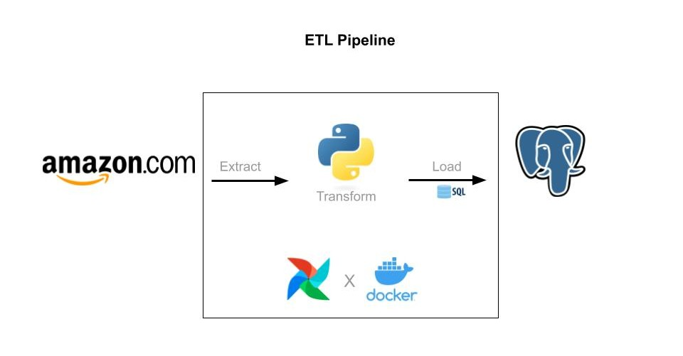

# Amazon Books ETL Pipeline

This project implements an ETL (Extract, Transform, Load) pipeline using **Apache Airflow** to scrape book data from **Amazon**, clean the results, and store them into a **PostgreSQL** database.

## 🚀 Features

- Automated scraping of Amazon search results for "Data Science" books.
- Data cleaning and deduplication using `pandas`.
- Data loading into PostgreSQL using Airflow's PostgresHook.
- Daily scheduled job using Airflow DAGs.
- Uses XCom to pass data between tasks.

## Create a virtual environment and activate it (optional)

    python -m venv venv
    source venv/bin/activate

## 🔗Important links and Code
-----

### Install Airflow 
-----

Follow steps in the link to setup airflow - https://airflow.apache.org/docs/apache-airflow/stable/howto/docker-compose/index.html

### Install PGAdmin 
-----
Code to add in yaml file 

    postgres:
      image: postgres:13
      environment:
        POSTGRES_USER: airflow
        POSTGRES_PASSWORD: airflow
        POSTGRES_DB: airflow
      volumes:
        - postgres-db-volume:/var/lib/postgresql/data
      healthcheck:
        test: ["CMD", "pg_isready", "-U", "airflow"]
        interval: 10s
        retries: 5
        start_period: 5s
      restart: always
      ports:
       - "5432:5432"
  
    pgadmin:
      container_name: pgadmin4_container2
      image: dpage/pgadmin4  
      restart: always  
      environment:
        PGADMIN_DEFAULT_EMAIL: admin@admin.com
        PGADMIN_DEFAULT_PASSWORD: root  
      ports:
       - "5050:80"

       
## 🔧 Airflow Setup
**1. Add Postgres Connection in Airflow UI:**
- Go to Airflow UI → Admin → Connections → Create
- Conn Id: books_connection
- Conn Type: Postgres
- Fill in host, schema, login, password, and port.

**2. Deploy the DAG:**
- Place amazon_books_dag.py in your Airflow DAGs folder.
- Trigger the DAG manually or wait for the scheduled run.

## ⚙️ DAG Workflow
1. `fetch_book_data`
    -> Scrapes book data from Amazon.
    -> Pushes the cleaned CSV to XCom.

2. `create_table`
    -> Ensures the books table exists in the PostgreSQL database.

3. `insert_book_data`
    -> Pulls CSV from XCom.
    -> Parses and inserts into the books table.

